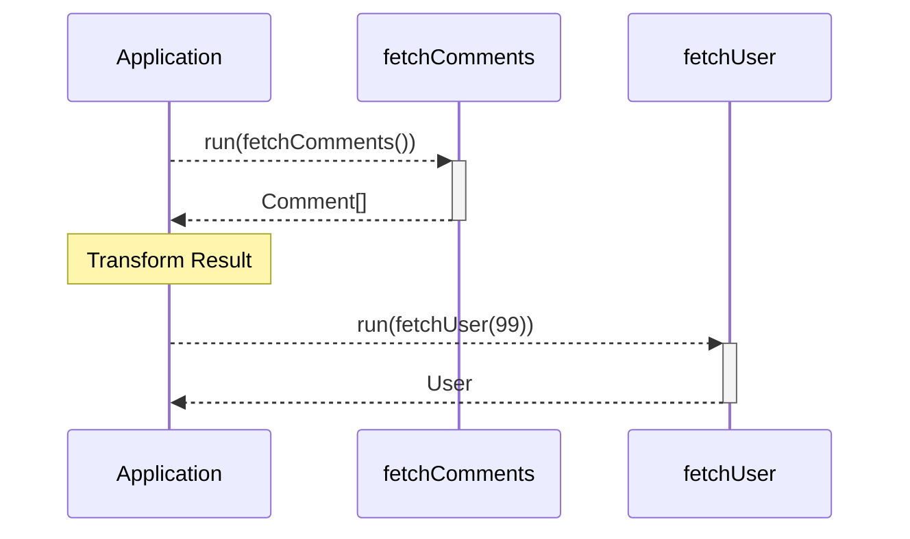
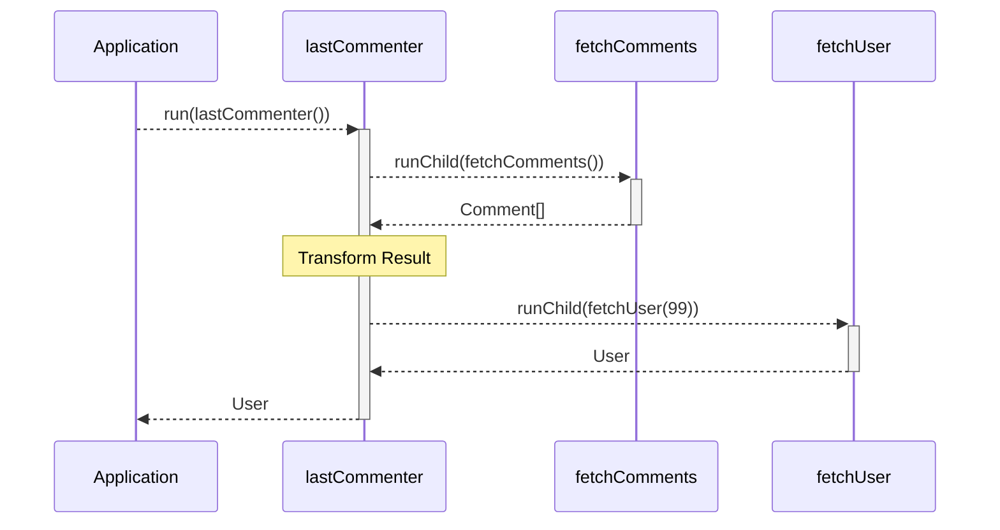

So far, we have only looked at running a single Task. In this chapter, we will look at how to _compose_ and _coordinate_ multiple Tasks by examining:

- The forms of composition offered by mgFx and their differences
- Running one Task as a 'child' of another.
- The 'environment' available to Task implementations.

## Forms of composition

It is often desirable to implement computer programs such that they consist of distinct, and re-usable 'building blocks'. mgFx offers two patterns to support this premise:

- 'Explicit' composition
- 'Implicit' or 'hierarchical' composition

### Explicit composition

In this pattern, Tasks are designed such that they are each responsible for some discrete unit of functionality, and the developer is expected to explicitly 'chain' the invocation of each Task into another. Take the following example:

```typescript file=./task-composition-explicit.ts
```

Observe how the composition of `fetchComments` and `fetchUser` are explicit. It is expected that the programmer be aware of the `fetchComments` and `fetchUser` tasks, and then _explicitly_ chains them together using `connector.run()`. If we were to imagine this flow as a sequence diagram, it may look something like this:



Depending on circumstances, it may not be desirable for Tasks to be explicitly composed like this. That's where 'implicit' composition, or _Hierarchical_ Tasks come into play.

### Implicit composition

mgFx offers the ability for one Task to run _another_ task in it's implementation. This allows us to create a hierarchy of _Parent_ and _Child_ Tasks, and therefore compose multiple tasks in an implicit manner.

So far, we've look at how Task implementations accept Input via the first parameter that is passed to the Implementation function. However, there's also a second _Environment_ parameter. The Environment object includes a `runChild` method, and has a similar signature to that of `connector.run()`:

```typescript file=./task-composition-implicit.ts
```

The sequence diagram for this flow is similar to the last one we looked at, with some subtle differences:



Notice how:

- Your Application code now only has to invoke a single Task.
- Intermediate processing of data and 'chaining' Tasks together is handled within a Task.

The `runChild` Environment function allows you to create arbitrarily complex and deep Task hierarchies, whilst maintaining a clean separation of responsibility between discrete units of work.

Additionally, when a Task is run as a Child of another, this link is expressed in Analysis tools (more on those in the next chapter.)

## Considerations

mgFx allows you to pick which of these two approaches best fits your use-case. However, there are some points to consider for each:

- **Does your Task consist of operations against a mixture of different resources?**

  Use `runChild` to break your Task up:

  - Each 'child' Task contains behaviour specific to the associated resource.
  - Better visibility into operations against each resource.

- **Does your Task perform the same (or similar) sub-processes in a concurrent manner with differing inputs?**

  Make the 'branch' a Task and invoke it via `runChild` within the concurrent region:

  - Visibility into each loop.

- **Does your Task perform latency-critical and/or intensive loops?**

  Use a single Task:

  - Avoids serialization and/or messaging overheads incurred by mgFx - this is minor, but loops can cause this to add up easily.

## Conculsions

In this chapter we covered:

- The differences between explicit and implicit composition
- The `runChild` function available to Task Implementations

In the next chapter, we will look at arguably one of mgFx's greatest feature - runtime analysis.
